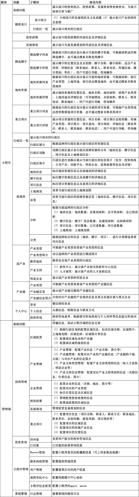

 

    
 

公司拥有上百套具有自主知识产权的软件系统，详情请查看码云首页或公司官网

 
<h1>招商宣传</h1>

<a href="https://www.haishi.net.cn/">公司官网</a> ｜ <a href="https://www.haishi.net.cn/">在线体验</a>

 

## 系统介绍

以可视化、形象化方式全方位展示区域投资环境、人才政策、园区载体及配套服务情况，投资企业通过平台“一站式”了解区域投资和人才环境。集成全区域政策、项目、资源要素信息，打造全区域招商引资数据平台。
以可视化、形象化方式全方位展示区域投资环境、人才政策、园区载体及配套服务情况，投资企业通过平台“一站式”了解区域投资和人才环境。集成全区域政策、项目、资源要素信息，打造全区域招商引资数据平台。
本项目名称为智慧乡村-云展厅系统，旨在为乡村提供一个数字化展示平台，涵盖乡村产业、行政区域、政策规划、企业信息、产业支持、地块资源、楼宇信息、项目进展等方面的内容，并提供用户咨询功能。该系统方便用户了解乡村的整体情况，促进乡村发展。
本项目主要面向用户提供一个操作便捷的Web平台：云展厅系统。
- 云展厅系统：面向公众用户，提供信息浏览、查询、咨询等功能。
                

## 系统功能介绍

### 系统包含终端说明

管理端（WEB）、用户端（微信小程序）

| 序号 | 模块 | 模块说明 |
| ---- | ---- | -------- |

### 系统功能结构

### 系统功能说明

主要功能：
- 数据雷达：提供乡村关键数据的可视化展示。
- 产业管理：对乡村产业进行管理，包括产业链管理。
- 行政区域：展示乡村行政区划信息。
- 政策规划：展示乡村相关的政策规划。
- 企业管理：管理乡村企业信息。
- 产业支持：提供产业支持相关信息。
- 功能平台：提供各种功能平台入口。
- 地块管理：管理乡村地块信息。
- 楼宇管理：管理乡村楼宇信息。
- 项目管理：管理乡村项目信息。
- 轮播图管理：管理系统首页轮播图。
- 用户咨询：提供用户咨询渠道。
- 系统管理：进行系统配置和用户管理。

## 系统主要界面

## 系统技术说明

### 代码模块说明

| 序号 | 目录 | 目录说明 |
| ---- | ---- | -------- |

### 系统技术选型

#### 开发语言/框架

JAVA（JDK1.8）
前端框架：VUE2

#### 服务中间件

Nginx
Tomcat

#### 数据库

MySQL（5.7+）
Redis

#### 其他说明

无

## 系统演示/商用

请扫码添加客服微信获取演示地址和系统详细资料。

如果您想基于招商宣传进行商业化交付或定制开发服务，我们提供有偿的技术服务支持，合作模式不限，欢迎沟通！

公司官网地址： <a href="https://www.haishi.net.cn/">https://www.haishi.net.cn</a>

联系客服获取专业回答。

## 使用须知

1、 本项目商用必须获得版权所有者的授权。

2、 未经允许本项目代码不允许二次出售。

